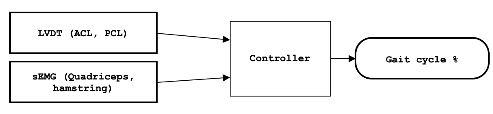
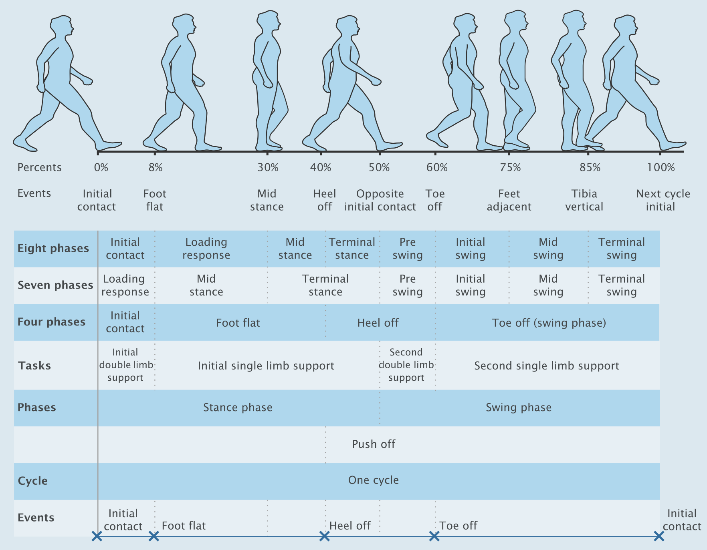
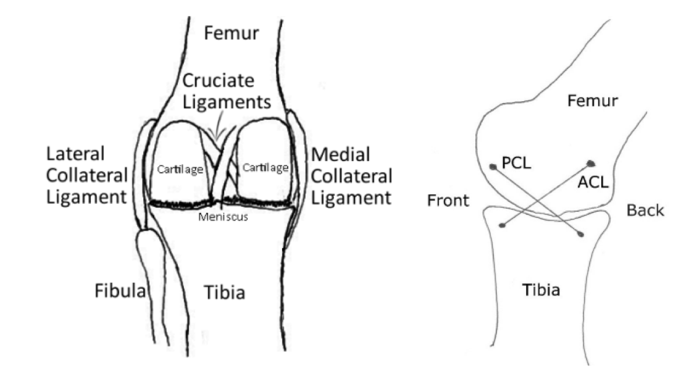
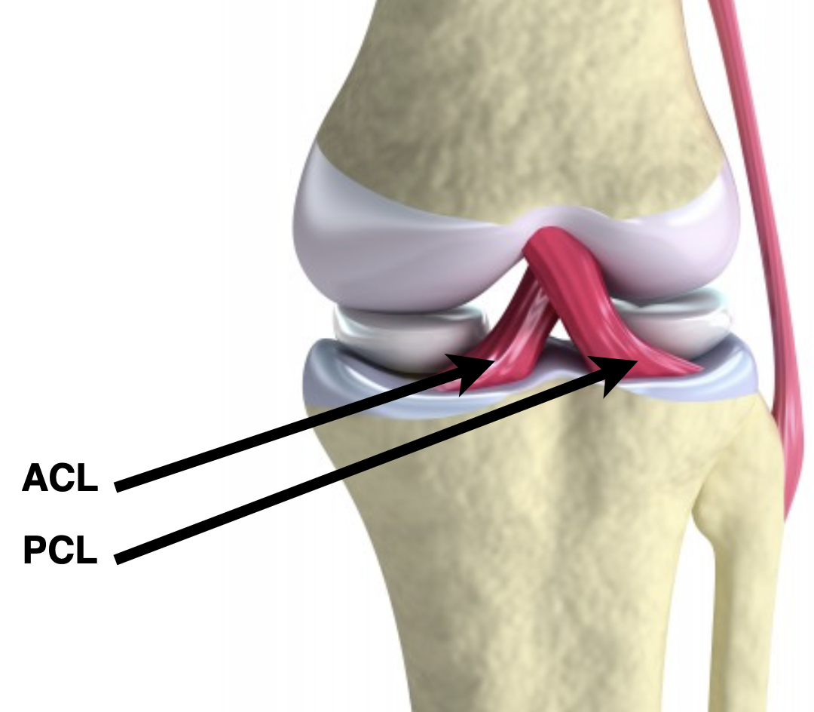

# BEng Final Project

This is private repository for the **EVENT DETECTION FOR POWERED
LIMB PROTHESIS** project. This README file contains important information.

### Aims and objectives.

The project aim is to develop a algorithm for the gait phase detection/prediction based on mechanical(LVDT) and electrophysiological signals(sEMG). These are the signals obtained from the user/patient. To confirm the results it would be beneficial to get signals from the outside (motion capture cameras).

- Identify the mechanical signals: The LVDT converts a position or linear displacement from a mechanical reference (zero or null position) into a proportional electrical signal containing phase (for direction) and amplitude (for distance) information.[wikipedia:LVDT](https://en.wikipedia.org/wiki/Linear_variable_differential_transformer)
  - Sub-signals: ACL and PCL displacements. A lot about this and the bycondylar knee: [A Complete Robotic Knee As a Tool for a Better Understanding of Joint Dynamics]([https://](https://www.biomechatronicslab.co.uk/research/Project?ID=11))
- Identify the electrophysiological signals: Recording of the changes in electric potential of muscle by means of surface or needle electrodes. [national Library Medicine: EMG](https://meshb.nlm.nih.gov/record/ui?ui=D004576)
  - Sub-signals: Medial hamstring (hamstring) sEMG for **flexion** and vastus medialis (quadriceps) sEMG for **extension**.
- Collect the data (from above) from one healthy individual. (me)
- Analyse the data.
  - Get cycles (most likely using the foot force sensor)
  - Get two phases
  - Get four phases 

- Try to identify the phases online.
- Contact the Superhumans and possibly set uo a short meeting to see how they can help me and how i can help them.

- How to get the phase out of the given data? There are many papers about the ML techniques applied to the sEMG. Discuss why is it insufficient(and is it?). 
- Challenges:
  - It has to be error free/corrected for errors so the user doesn't loose confidence. (Unlikely to be included into the project scope, but has to be mentioned)
  - Time latency. Included in some papers (**TODO** find it) 

>**Previous year**: The aim of this project is to understand if events in human movement, such as gait, can be predicted
using mechanical and electrophysiological signals. The following objects will be completed to
achieve this:
>
>- To update the design and fabricate the knee prothesis rig.
>
>- To measure the kinematics and muscle activity of the lower limb simultaneously during gait.
>
>- To analyse the kinematic and muscle data as a time series to identity markers that are
predictive of changes in speed.

## Reading list

Vu, Huong Thi Thu, Dianbiao Dong, Hoang-Long Cao, Tom Verstraten, Dirk Lefeber, Bram
Vanderborght, and Joost Geeroms. ‘A Review of Gait Phase Detection Algorithms for Lower Limb
Prostheses’. Sensors 20, no. 14 (January 2020): 3972. https://doi.org/10.3390/s20143972.

Hof, A.L., H. Elzinga, W. Grimmius, and J.P.K. Halbertsma. ‘Speed Dependence of Averaged
EMG Profiles in Walking’. Gait & Posture 16, no. 1 (August 2002): 78–86.
https://doi.org/10.1016/S0966-6362(01)00206-5.

 Huber, Cora, Corina Nüesch, Beat Göpfert, Philippe C. Cattin, and Vinzenz Von Tscharner.
‘Muscular Timing and Inter-Muscular Coordination in Healthy Females While Walking’. Journal of
Neuroscience Methods 201, no. 1 (September 2011): 27–34.
https://doi.org/10.1016/j.jneumeth.2011.07.008.

## Report notes

The purpose of this report is to identify markers for event detection that correlate to a change in walking speed. The Russell knee joint is a mechanical knee which mimics the movement of the human knee in the sagittal plane.

## The Russel knee joint

It has also been shown that the mechanical structure of the human knee, two condyles connected with ligaments, has some mechanical advantages over a simple pin joint [3]. There is, however, no current robust method for estimating the angle of such a joint for use in a controller since the polycentric nature of the joint makes the incorporation of potentiometers or encoders into the mechanism challenging.

A layer of smooth cartilage covers the femoral and tibial condyles which allows low friction sliding between the joint surfaces.

The four ligaments are the anterior crutiate ligament (ACL) and posterior crutiate ligament (PCL) - these are found in the centre of the knee (Figure 1) - and the medial and lateral collateral ligaments (MCL and LCL) which are found on the sides of the joint.

There is evidence from microscope observations that there are mechanoreceptors present within the ligaments [9]. Dis- charge from these receptors has been measured [10] and it is now thought likely that these signals are used to modify muscle stiffness [11]. It has generally been agreed that the afferent signals controlling joint stability interact in a complex manner within the wider sensorimotor system [12] there is, however, no doubt that they play an important roll in joint control. This is evidenced by tests in cats and humans that have shown that removing or deafferenting these structures can impair joint function [13], [14], [15]. For a full review on the sensory role of crutiate ligaments see Johansson et al [16]. There may therefore be some benefit in incorporating the physical and neurosensory features of the human knee into a robotic knee.

With the current model it is not possible to predict the joint angle using ligament feedback alone outside of that small range, at this stage we sought only to prove the possibility of using ligament feedback for joint control. Refinement of the technique is a matter for future work.

Features of the human knee joint such as: varying moment arm, rolling condyles and elastic ligaments are incorporated.

## General notes (to be moved)

1. How to calculate and angle of the four-bar rigid body (ACL, PCL, tibia, femur)?
   1. Final Report 2024 8.1.3 – Motion Capture Functions.(I see the function, but i don't understand it)